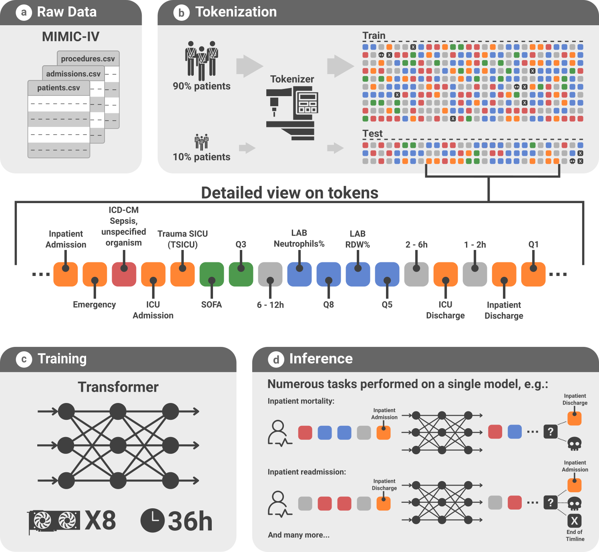

# ETHOS: Enhanced Transformer for Health Outcome Simulation

ETHOS is a novel application of the transformer deep-learning architecture, originally
conceptualized for natural language processing2. This architecture, a cornerstone in large language
model (LLM) development, is repurposed in ETHOS to analyze health-related data, moving beyond the
textual focus of traditional LLMs. ETHOS is designed to process Patient Health Timelines (PHTs) -
detailed tokenized chronological records of health-related events - to predict future health
timelines.



### Installation

Ensure your development environment is set up by following these steps:

#### Setting up the Environment

Python 3.10 or higher is required. Within the project root, activate development mode (`-e`) and install all necessary dependencies for
running notebooks and scripts by executing:

```bash
pip install -e .[all]
```

#### Exploring Package Functionalities

To discover what the package offers, use:

```bash
ethos --help
```

### Data Preparation

Prepare your dataset for analysis with these steps:

1. **Downloading the dataset:** Obtain the raw MIMIC-IV data
   from [PhysioNet](https://physionet.org/content/mimiciv/2.2/).
2. **Splitting the data:** Use the `scripts/data_train_test_split.py` script to divide the dataset
   into
   training and testing sets. This step requires 64GB of RAM. The script generates a processed
   dataset folder named with a `_Data` suffix. Ensure the processed data is
   named `mimic-iv-2.2_Data` or
   update the folder name in `ethos/tokenize/constants.py` accordingly.
3. **Organizing Dataset Directories:** Place the datasets in the project's data directory as
   follows:
   ```
   PROJECT_ROOT
   ├── pyproject.toml
   ├── README.md
   ├── scripts
   └── ethos
       └── data 
           ├── icd10cm-order-Jan-2021.csv.gz
           ├── drug_coding.py
           ├── mimic-iv-2.2              <== raw data from physionet.org
           ├── mimic-iv-2.2_Data         <== processed data (train/test split)
           └── mimic-iv-2.2_Data_parquet <== optional (for faster loading `scripts/convert_csv_to_parquet.py`)
   ```

### Workflow

Execute the project workflow as follows:

1. **Dataset tokenization:** Convert the dataset from a tabular format to a tokenized format,
   starting with the training set, followed by the testing set using the training set's vocabulary.
   ```bash
   ethos tokenize- mimic train 
   ```
   Followed by:
   ```bash
   ethos tokenize- mimic test -v <path_to_vocab>
   ```
2. **Model training:** Train the model on the tokenized dataset. Monitor the training process with
   wandb (optional, check `scripts/run_training.py`). Example configuration for running on 8 GPUs
   (adjust `--nproc_per_node` and `--gradient_accumulation_steps` to match your setup):
   ```bash
   torchrun --no_python --standalone --nproc_per_node=8 ethos train \
     --data_train <data_path> \
     --val_frac 0.04 \
     --vocab <vocab-path> \
     --batch_size 32 \
     --block_size 2048 \
     --n_layer 6 \
     --n_head 12 \
     --n_embd 768 \
     --dropout 0.3 \
     --lr $LR \
     --min_lr $MIN_LR \
     --log_interval 5 \
     --eval_interval 1000 \
     --gradient_accumulation_steps 8 \
     --max_iters 1000000 \
     --lr_decay_iters 50000 \
     --eval_iters 50 \
     --ctx_no_grad \
     --out_dir "out/mimic_layer_6_batch_32_do_0.3"
   ```
3. **Model evaluation:** Use the trained model for predicting future health timelines based on
   scenarios found in ethos/datasets, like ICU readmission or hospital mortality.
   ```bash
   ethos infer \
     --test readmission \
     --data <data-path> \
     --vocab <vocab-path> \
     --model <model-path> \
     --out_dir <output-path>
   ```
   Refer to `scripts/run_inference.sh` for more detailed usage.
4. **Generating results:** Use the Jupyter notebooks to generate all the results and figures:
   - `notebooks/mimic_paper_results_agg.ipynb`
   - `notebooks/embedding_analysis.ipynb`